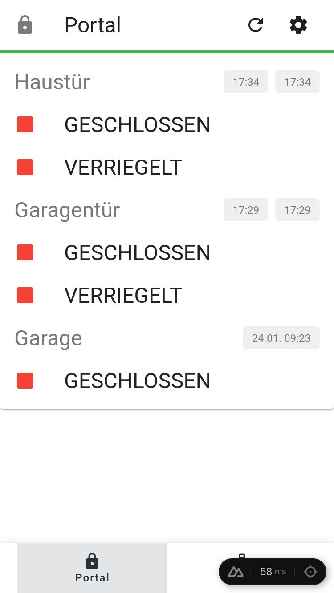
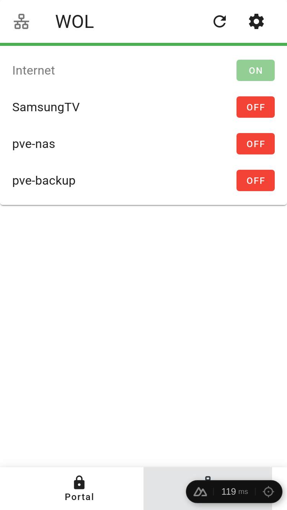
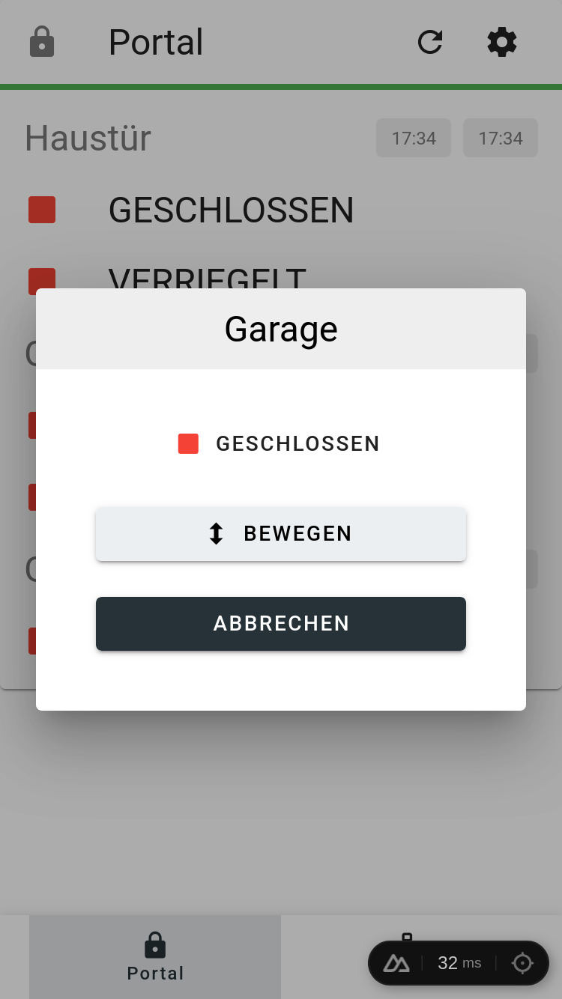

# MuhPortalWeb

**MUH Portal Web** - Home Automation Frontend

A modern home automation frontend built with Nuxt 4, Vue 3, Vuetify 3, and MQTT

## Contents

 * [Screenshots](#screenshots)
 * [Features](#features)
 * [Installation](#installation)
 * [Configuration](#configuration)
 * [MQTT Topics](#mqtt-topics)

## Screenshots

<p align="center">
  
  
  
</p>

## Features

 * Display garage & doors status
 * Control garage & doors
 * List servers & Wake-on-LAN
 * Shutdown servers via MQTT
  
### Technology Stack

 * Nuxt 4
 * Vue 3
 * Vuetify 3
 * Socket.IO (frontend to backend communication)
 * MQTT (backend to MQTT broker communication)

## Installation

### Prerequisites

Install Node.js 20+ and an MQTT broker (e.g., Mosquitto). The MQTT broker no longer needs WebSocket support enabled, as the backend connects using the standard MQTT protocol.

### Development

```bash
# Clone repository
git clone https://github.com/13/muhportalweb.git
cd muhportalweb

# Install dependencies
npm install

# Start development server
npm run dev
```

### Production

```bash
# Build for production
npm run build

# Start production server
node .output/server/index.mjs

# Or preview production build
npm run preview

# Or use Docker
docker compose up
```

## Configuration

Create a `.env` file based on `.env.example`:

```bash
# MQTT Broker URL (backend connects to this using standard MQTT)
# Use mqtt:// for TCP (port 1883) - recommended for best performance
# Use ws:// for WebSocket (port 1884) - use if only HTTP ports are allowed
MQTT_BROKER_URL=mqtt://192.168.22.5:1883

# CORS Configuration for Socket.IO (comma-separated list of allowed origins)
# Use '*' for all origins (not recommended in production) or specific URLs
CORS_ORIGINS=http://localhost:3000,https://yourdomain.com

# Nuxt server configuration
NUXT_HOST=0.0.0.0
NUXT_PORT=3000
```

### Docker Configuration

Docker Compose automatically reads the `.env` file and passes environment variables to the container. You can also override variables directly:

```bash
# Using .env file (recommended)
cp .env.example .env
# Edit .env with your settings
docker compose up

# Or override specific variables via command line
MQTT_BROKER_URL=mqtt://broker.example.com:1883 docker compose up
```

## MQTT Topics

### Portal (Doors/Locks)

**Subscribe:** `muh/portal/+/json`
- Topics: `G` (Garage), `GD` (Garage Door), `GDL` (Garage Door Lock), `HD` (House Door), `HDL` (House Door Lock)
- Payload: `{"state": 1, "time": "2026-01-24T09:23:16"}`

**Publish:** `muh/portal/RLY/cmnd`
- Payload: `<portal>_<action>` (e.g., `G_T`, `HD_O`, `HDL_L`)
- Actions: `T` (Toggle/Move), `O` (Open), `L` (Lock), `U` (Unlock)

### WOL (Wake-on-LAN)

**Subscribe:** `muh/pc/#`
- Payload: `{"name":"server.local","ip":"192.168.1.100","mac":"00:11:22:33:44:55","alive":false,"priority":1}`

**Publish:** 
- Wake: `muh/wol` with `{"mac":"00:11:22:33:44:55"}`
- Shutdown: `muh/poweroff` with `{"mac":"00:11:22:33:44:55"}`
